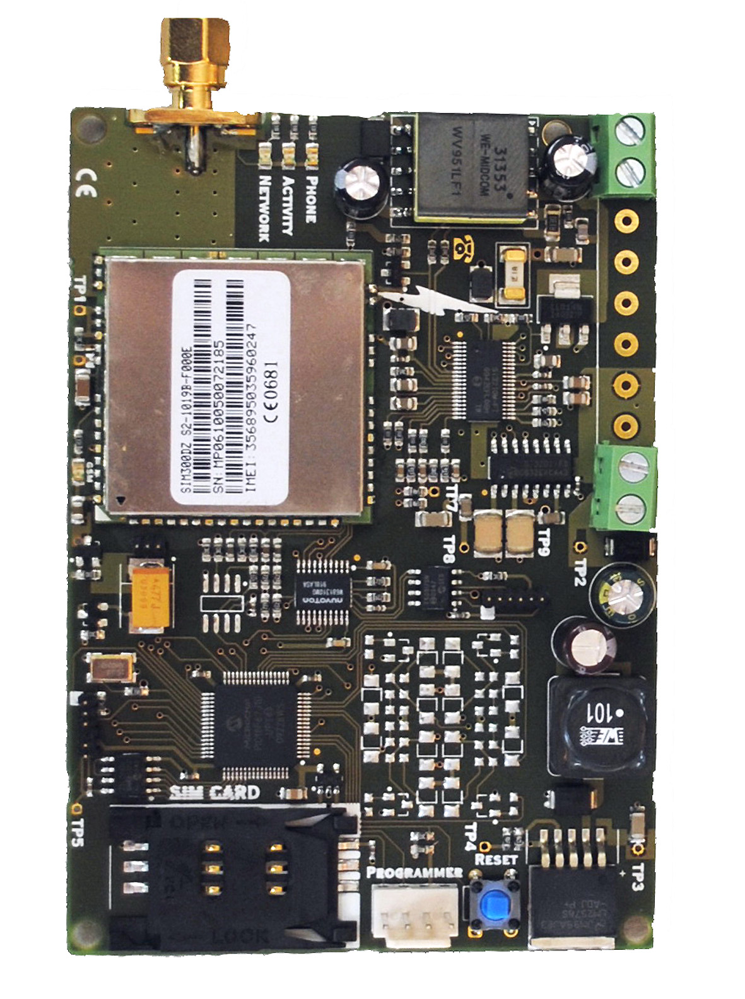

### WiLARM ContactID GSM
Version 2010
### Description
A WiLARM ContactID GSM készülék egy speciális távjelző eszköz, amely képes
riasztóközpont jelzéseit távfelügyeleti központba továbbítani. Csatlakoztatása a
riasztó központ telefon vonal kimenetére történik.
A készülék felépítését tekintve tartalmaz egy kártya független ipari GSM adó-vevő
egységet, telefon szimulátor áramkört, illetve egy intelligens mikroprocesszort,
amelyek egymással együttműködve látják el a kívánt feladatot.
A készüléket telepítés után SMS üzenetekkel illetve számítógépről, USB vagy soros
adatkábelek segítségével lehet beállítani, valamint felprogramozni (pl. telefonszám,
beállítások, tesztelés), stb. Az SMS programozást egy 4 jegyű saját biztonsági kód
védi, mely számokból és betűkből egyaránt állhat.
Általános szabály, hogy az SMS alapú programozásnál minden parancsot a biztonsági
kóddal kell kezdeni. A parancsok beírásakor figyelmet kell fordítani arra, hogy csak
kis betűket használjunk.

Hardware picture:

